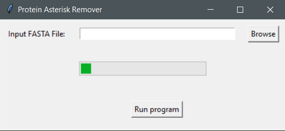

# Protein-Asterisk-Remover
Windows GUI app that removes * from the end of each sequence in an input fasta file

## Dependencies

1. Windows 11 or 10 version 16215.0 or higher(type `winver` on the search button and click `winver` to find your OS version)
2. [Windows Subsystem for linux(wsl1)](INSTALL.md)
3. the file in the `bin` folder

## Usage 

Click on the `Protein Asterisk Remover.exe` file

Click `browse` and select an input file

Click `Run program` 

When the program finishes successfully, the asterisk(*) will be removed from sequences of the input file

Example input/output files can be found [here](data/input/ITAG4.1_proteins.fasta) and [here](data/output/ITAG4.1_proteins.fasta) 

Input file for was downloaded from solgenomics.net tomato annotation version 4.1.

